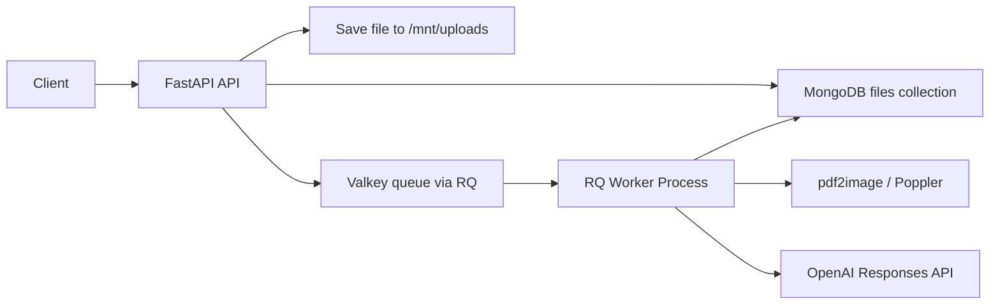

# PDF-processor

## What This Project Is
This project is an asynchronous PDF-processing service with a **multi-service** layout:

- **frontend/** – React (Vite) UI that uploads PDFs and shows status/result via the backend API
- **backend/** – FastAPI server: accepts uploads and exposes status/result endpoints
- **worker/** – RQ worker image (uses backend app code): long-running process that processes queued jobs

Shared infrastructure (same for all):

- **Valkey/Redis**: stores queued jobs
- **MongoDB**: stores file metadata, status, and final result

This is **not a full RAG system** right now.
It is a document-processing pipeline that:

1. uploads a PDF
2. saves it to disk
3. queues background processing
4. converts the PDF to images
5. sends the first page image to OpenAI
6. stores the output in MongoDB

## If You Come From C#
Your mental model is correct.

In C# you might create a hosted background service that:

- starts with the app
- keeps listening for work
- processes messages from a queue

The Python equivalent here is:

- `api` container/process: accepts requests and enqueues jobs
- `worker` container/process: runs forever and waits for queue messages
- Valkey/Redis: holds the queued job payloads
- RQ: the Python queue library that connects the worker to Valkey

### Important distinction
- **Valkey/Redis** is the queue storage engine
- **RQ** is the Python library/protocol on top of Redis
- **Worker** is the actual running process that polls the queue and executes jobs

So when you ask "how is RQ started?" the answer is:

- RQ is not a standalone server like RabbitMQ
- the **worker process** starts RQ's worker loop in Python
- that loop blocks forever, polling Valkey for jobs

## High-Level Runtime Diagram



## Backtrace: What Happens on Upload

### 1. Client uploads a file
Route:

- `POST /upload`

Code:

- [server.py](backend/app/server.py)

Flow:

1. insert a Mongo document with status `saving`
2. write the file under `UPLOAD_ROOT/<file_id>/<filename>`
3. enqueue `process_file_job(file_id, file_path)`
4. update Mongo status to `queued`
5. return `file_id`

### 2. Worker picks up the job
Code:

- [worker.py](backend/app/worker.py)
- [workers.py](backend/app/queue/workers.py)

How it works:

- `python -m app.worker` starts an `rq.Worker`
- that worker subscribes to the configured queue name
- it keeps running forever
- when a job appears in Valkey, the worker executes `process_file_job(...)`

This is the "always-listening background process" equivalent you described from C#.

### 3. `process_file_job` runs
`process_file_job` is a **synchronous RQ entrypoint**.

That matters because RQ expects a normal Python function, not an async coroutine.

Inside that sync function, the code does:

- `asyncio.run(_process_file_async(...))`

So the actual document workflow stays async-friendly for MongoDB, but the outer job entrypoint remains compatible with RQ.

### 4. Async document pipeline executes
Inside `_process_file_async(...)`:

1. set status to `processing`
2. set status to `converting_to_images`
3. run `pdf2image.convert_from_path(file_path)`
4. save JPG pages to `UPLOAD_ROOT/images/<file_id>/`
5. set status to `images_ready`
6. base64 encode first image
7. call OpenAI Responses API
8. set status to `processed` and save result
9. on any exception, set status to `failed`

## How the Worker Is Actually Run
There are now two ways.

### Docker Compose (recommended)

From the repo root:

```bash
cp .env.example .env   # edit .env with OPENAI_API_KEY etc.
docker compose up --build
```

This starts:

- **api** – backend on http://localhost:8000
- **worker** – RQ worker
- **frontend** – UI on http://localhost:80 (or http://localhost)
- **mongo**, **valkey**

### Local development (without Docker)

1. **Backend & worker** (from `backend/`):
   - MongoDB and Valkey running (e.g. via `docker compose up mongo valkey -d`).
   - API: `./scripts/run-api.sh` (or `uvicorn app.server:app --reload`)
   - Worker: `./scripts/run-worker.sh`

2. **Frontend** (from `frontend/`):
   - `npm install && npm run dev` (Vite proxies `/api` to backend if backend is on port 8000).

## How Mongo and RQ Are Started

### MongoDB
Mongo is started by Docker Compose using the `mongo:7` image.

Defined in:

- [docker-compose.yml](docker-compose.yml)

### Valkey
Valkey is also started by Docker Compose using the `valkey/valkey:8` image.

Defined in:

- [docker-compose.yml](docker-compose.yml)

### RQ
RQ is not started as its own infrastructure container.

Instead, the **worker container** runs Python code:

```bash
python -m app.worker
```

That process creates:

```python
Worker([RQ_QUEUE_NAME], connection=redis_connection)
```

and then calls:

```python
worker.work()
```

That method blocks forever and keeps polling Valkey for new jobs.

## Files You Should Know First

### Runtime entrypoints
- [scripts/run-api.sh](backend/scripts/run-api.sh)
- [scripts/run-worker.sh](backend/scripts/run-worker.sh)

### Makefile helpers
For common docker-compose workflows you can also use the `Makefile`:

```bash
make up       # docker compose up --build
make down     # docker compose down
make restart  # restart the stack
```

### App server (backend)
- [server.py](backend/app/server.py)
- [main.py](backend/app/main.py)

### Queue runtime
- [q.py](backend/app/queue/q.py)
- [workers.py](backend/app/queue/workers.py)
- [worker.py](backend/app/worker.py)

### Database
- [client.py](backend/app/db/client.py)
- [db.py](backend/app/db/db.py)
- [files.py](backend/app/db/collections/files.py)

### Config and infra
- `backend/app/config.py`
- `backend/Dockerfile`, `worker/Dockerfile`, `frontend/Dockerfile`
- `docker-compose.yml`, root `.env` / `.env.example`

## Environment Variables
Copy `.env.example` to `.env` and fill in the OpenAI key.

Variables:

- `MONGO_URI`
- `MONGO_DB_NAME`
- `REDIS_HOST`
- `REDIS_PORT`
- `RQ_QUEUE_NAME`
- `UPLOAD_ROOT`
- `OPENAI_API_KEY`
- `OPENAI_MODEL`

## API Endpoints

### `GET /`
Returns:

```json
{"status": "healthy"}
```

### `POST /upload`
Multipart upload endpoint.

Returns:

```json
{"file_id": "..."}
```

### `GET /{id}`
Returns current processing status and result.

Example shape:

```json
{
  "_id": "...",
  "name": "resume.pdf",
  "status": "processed",
  "result": "..."
}
```

## Project layout (multi-service)

```text
pdf-processor-api/
├── frontend/       # React UI (Vite), calls backend API
├── backend/        # FastAPI app + shared app code
├── worker/         # Dockerfile only; image uses backend app, runs RQ worker
├── docker-compose.yml   # api, worker, frontend, mongo, valkey
└── .env / .env.example
```

## Container topology

```text
api       -> backend image (FastAPI)
worker    -> worker image (RQ worker, same app as backend)
frontend  -> serves UI; /api/* proxied to api:8000
mongo     -> metadata/result store
valkey    -> queue backend
```

## Important Notes
- This is now runnable as a proper local multi-process stack.
- The OpenAI key is no longer hardcoded in source.
- The queued job is now RQ-compatible.
- This still is not a true RAG system yet.

## If You Want Real RAG Next
The missing pieces would be:

1. extract text from PDF
2. chunk the text
3. embed chunks
4. store embeddings in a vector DB
5. retrieve chunks for queries
6. generate answers grounded in retrieved context

Right now the system is doing document ingestion + image-based AI processing, not retrieval-augmented generation.
